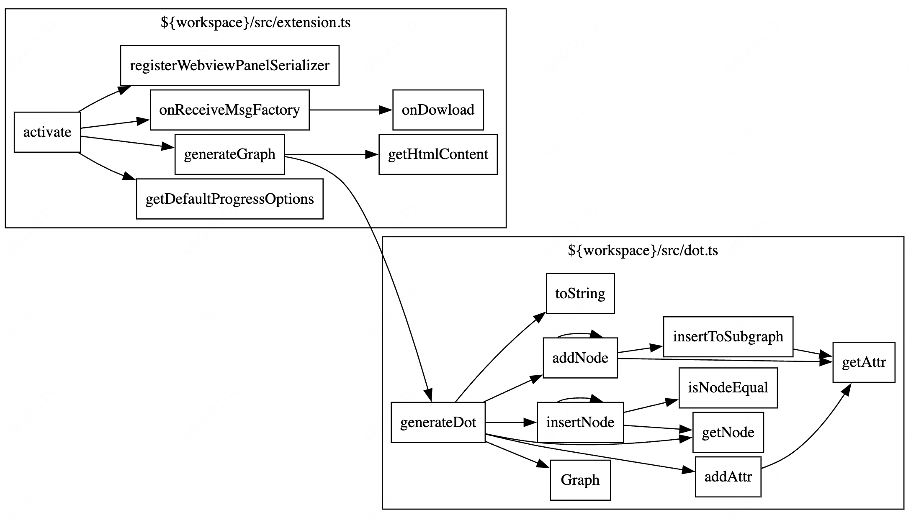

# call-graph

vscode extension for generate call graph in [graphviz dot language](https://www.graphviz.org/doc/info/lang.html), based on vscode call hierarchy language feature.

## Features

-   Generate call graph in graphviz dot language and preview
-   Generate sequence diagrams using Mermaid syntax
-   Generate class diagrams using Mermaid syntax
-   **Global Component Diagram:** Generate a workspace-wide diagram showing classes, interfaces, inheritance, implementations, and collaborations (method calls).
-   Save graph as dot or svg file
-   Export sequence and class diagrams as SVG or download source code
-   Intelligent filtering of high in-degree nodes to reduce diagram complexity
-   Accurate representation of actual call sequence in sequence diagrams
-   Language-agnostic class detection for class diagrams (supports C++, Go, TypeScript, and more)

## Quick start

1. Open your folder and select a entry function
2. Run `CallGraph.showOutgoingCallGraph` command using context menu or `Ctrl+Shift+P` to show outgoing calls
3. Or Run `CallGraph.showIncomingCallGraph` command using context menu or `Ctrl+Shift+P` to show incoming calls
4. For sequence diagrams, use `CallGraph.showOutgoingSequenceDiagram` or `CallGraph.showIncomingSequenceDiagram`
5. For class diagrams, use `CallGraph.showOutgoingClassDiagram` or `CallGraph.showIncomingClassDiagram`
6. To view the **Global Component Diagram**, run `CallGraph: Show Global Component Diagram` from the Command Palette or editor context menu.
7. Click `save dot file` or `save as svg` in the bottom left corner to save the graph (for call graphs).
8. For sequence, class, and global component diagrams, use the "Export SVG" or "Download Source Code" buttons.
8. Add `.callgraphignore` file in your project root directory to ignore some files or folders in workspace (the syntax is the same as `.gitignore`)

## Configuration

You can configure `ignoreFile`(.callgraphignore by default), `maxDepth`, and `inDegreeThreshold`. See the descriptions in setting.

- `ignoreFile`: Path to the file that specifies paths to ignore (default: ${workspace}/.callgraphignore)
- `maxDepth`: The maximum depth of the call graph (default: 0, which means unlimited)
- `inDegreeThreshold`: Filter nodes with in-degree greater than this threshold in incoming call graphs (default: 5)

### Global Component Diagram

The Global Component Diagram provides a comprehensive overview of your entire workspace's structure. It visualizes:

-   **Classes and Interfaces:** All detected classes and interfaces within the configured scope.
-   **Inheritance:** `extends` relationships between classes.
-   **Implementations:** `implements` relationships between classes and interfaces.
-   **Collaborations:** `uses` relationships derived from method calls between classes.

This diagram is rendered using Mermaid.js.

**How to Use:**
-   Invoke the command `CallGraph: Show Global Component Diagram` from the Command Palette (Ctrl+Shift+P or Cmd+Shift+P) or by right-clicking in a text editor.

**Configuration:**
-   The scope of files included in this diagram can be controlled using the `call-graph.globalDiagram.include` and `call-graph.globalDiagram.exclude` settings. Please see the "Global Component Diagram Configuration" subsection below for details.

**Benefits:**
-   Helps in understanding the overall architecture of a project.
-   Useful for identifying key components, their dependencies, and interactions.
-   Aids in onboarding new developers by providing a high-level map of the codebase.

### Global Component Diagram Configuration

The following settings allow you to control the scope of files included when generating the "Global Component Diagram":

-   `call-graph.globalDiagram.include`: Glob pattern for files to include.
    -   Default: `**/*.ts`
    -   Example: `src/**/*.ts` (to only include files in the `src` directory)
-   `call-graph.globalDiagram.exclude`: Comma-separated glob patterns for files/directories to exclude.
    -   Default: `**/node_modules/**,**/*.spec.ts,**/*.test.ts`
    -   Example: `**/node_modules/**,**/dist/**,**/*.test.ts`

These settings help you tailor the diagram to focus on relevant parts of your codebase.

## Recent Updates

### Class Diagrams
- Added support for generating class diagrams using Mermaid syntax
- Class diagrams show relationships between classes based on function calls
- Only displays methods that are called by other classes for cleaner diagrams
- Language-agnostic implementation that works with multiple programming languages
- Export class diagrams as SVG or download the Mermaid source code

### Sequence Diagrams
- Added support for generating sequence diagrams using Mermaid syntax
- Sequence diagrams now accurately reflect the actual call order in your code
- Export sequence diagrams as SVG or download the Mermaid source code

### Node Filtering
- Improved filtering of high in-degree nodes to reduce diagram complexity
- Configurable threshold via the `inDegreeThreshold` setting

### UI Improvements
- Enhanced zoom and pan controls for better diagram navigation
- Added export functionality for both call graphs and sequence diagrams

## How it works

It depends `vscode.provideOutgoingCalls` and `vscode.provideIncomingCalls` built-in commands( the same with `Show Call Hierarchy` command, not available for some language server ).

## Changelog

See [CHANGELOG.md](./CHANGELOG.md).

## For more information

-   [GitHub Repository](https://github.com/beicause/call-graph)

## Donate

[Donate me via Paypal](https://paypal.me/beicause). Thank you for you support to this project and my open source works.

**Enjoy!**
