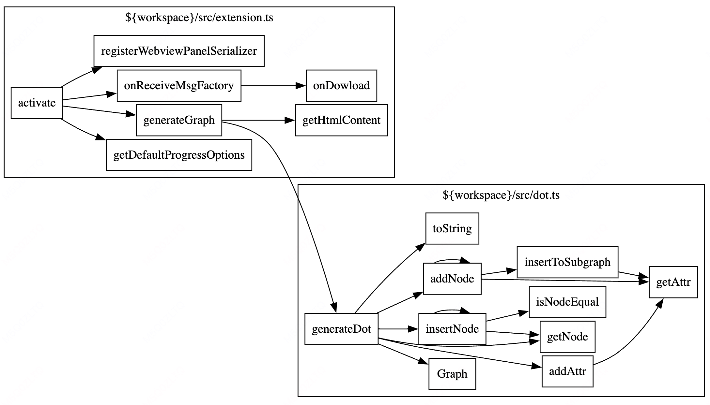

# call-graph

vscode extension for generate call graph in [mermaid](https://mermaid.js.org/) syntax, based on vscode call hierarchy language feature.

## Features

-   Generate call graph as a Mermaid flowchart and preview
-   Generate sequence diagrams using Mermaid syntax
-   Generate class diagrams using Mermaid syntax
-   Generate type hierarchy diagrams (supertypes and subtypes) using Mermaid syntax
-   Export every diagram as SVG or download its Mermaid source code
-   Click any element of a diagram to jump to the code it was drawn for
-   Intelligent filtering of high in-degree nodes to reduce diagram complexity
-   Accurate representation of actual call sequence in sequence diagrams
-   Language-agnostic class detection for class diagrams (supports C++, Go, TypeScript, and more)

## Quick start

1. Open your folder and select a entry function
2. Run `CallGraph.showOutgoingCallGraph` command using context menu or `Ctrl+Shift+P` to show outgoing calls
3. Or Run `CallGraph.showIncomingCallGraph` command using context menu or `Ctrl+Shift+P` to show incoming calls
4. For sequence diagrams, use `CallGraph.showOutgoingSequenceDiagram` or `CallGraph.showIncomingSequenceDiagram`
5. For class diagrams, use `CallGraph.showOutgoingClassDiagram` or `CallGraph.showIncomingClassDiagram`
6. For type hierarchies, put the cursor on a class or interface name and use `CallGraph.showSupertypes` or `CallGraph.showSubtypes`
7. Click a node, a class, a method, a participant or a message to open it in the editor
8. Use the "Export SVG" or "Download Source Code" buttons in the toolbar to save any diagram
9. Add `.callgraphignore` file in your project root directory to ignore some files or folders in workspace (the syntax is the same as `.gitignore`)

## Configuration

You can configure `ignoreFile`(.callgraphignore by default), `maxDepth`, and `inDegreeThreshold`. See the descriptions in setting.

-   `ignoreFile`: Path to the file that specifies paths to ignore (default: ${workspace}/.callgraphignore)
-   `maxDepth`: The maximum depth of the call graph (default: 0, which means unlimited)
-   `inDegreeThreshold`: Filter nodes with in-degree greater than this threshold in incoming call graphs (default: 5)

## Recent Updates

### Click to Source

-   Every diagram element opens the code it was drawn for: call graph nodes, class boxes and their method rows, type declarations, sequence participants and messages
-   The extension writes the positions next to the generated diagram, so panels stay navigable after a window reload

### Mermaid Call Graphs

-   Call graphs are rendered as Mermaid flowcharts instead of Graphviz dot, so every diagram of this extension uses the same renderer
-   Nodes are grouped in a subgraph per file, edges point from caller to callee
-   The Mermaid library is bundled with the extension, so call graphs still render without network access

### Type Hierarchy Diagrams

-   Added `CallGraph.showSupertypes` and `CallGraph.showSubtypes` for inheritance diagrams
-   Based on the type hierarchy language feature, so relations are resolved by the language server instead of inferred from call relations
-   Generalization (`extends`) is drawn as a solid arrow, realization (`implements`) as a dashed one
-   Respects the `maxDepth` and `ignoreFile` settings

### Class Diagrams

-   Added support for generating class diagrams using Mermaid syntax
-   Class diagrams show relationships between classes based on function calls
-   Only displays methods that are called by other classes for cleaner diagrams
-   Language-agnostic implementation that works with multiple programming languages
-   Export class diagrams as SVG or download the Mermaid source code

### Sequence Diagrams

-   Added support for generating sequence diagrams using Mermaid syntax
-   Sequence diagrams now accurately reflect the actual call order in your code
-   Export sequence diagrams as SVG or download the Mermaid source code

### Node Filtering

-   Improved filtering of high in-degree nodes to reduce diagram complexity
-   Configurable threshold via the `inDegreeThreshold` setting

### UI Improvements

-   Enhanced zoom and pan controls for better diagram navigation
-   Added export functionality for both call graphs and sequence diagrams

## How it works

It depends `vscode.provideOutgoingCalls` and `vscode.provideIncomingCalls` built-in commands( the same with `Show Call Hierarchy` command, not available for some language server ).

Type hierarchy diagrams depend on `vscode.provideSupertypes` and `vscode.provideSubtypes` ( the same with `Show Type Hierarchy` command, also not available for some language server ).

## Changelog

See [CHANGELOG.md](./CHANGELOG.md).

## For more information

-   [GitHub Repository](https://github.com/beicause/call-graph)

## Donate

[Donate me via Paypal](https://paypal.me/beicause). Thank you for you support to this project and my open source works.

**Enjoy!**
